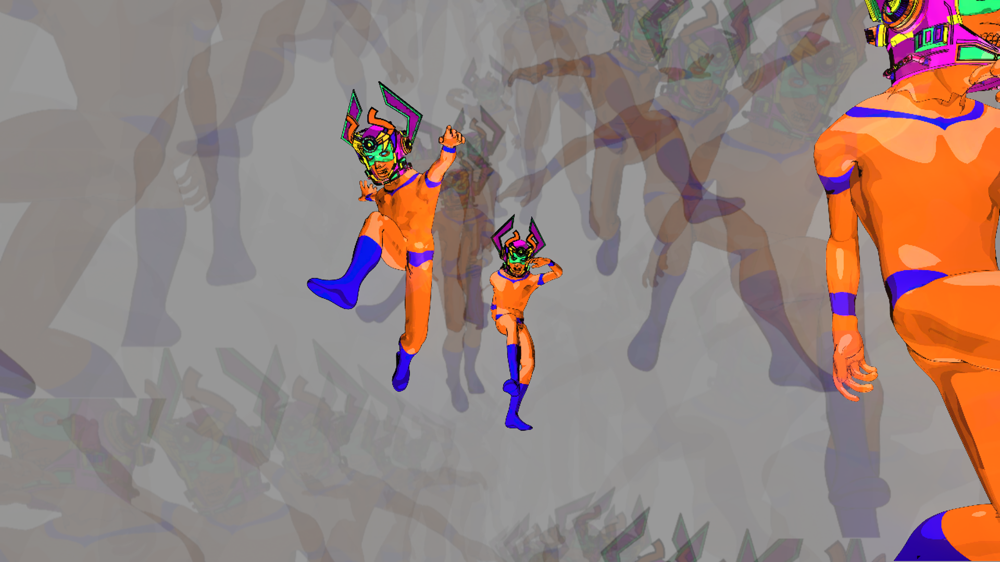

# Astronaught

> **AI-assisted project.** This codebase was created with [Claude](https://claude.com/claude-code)
> (Anthropic), directed and reviewed by a human author. The machine is verified
> numerically by an offline harness that drives the real plugin class in a
> headless GL context — the head spacing and the twelve-position Mode Selector
> are checked against Roland's own published tables, and the behaviour the whole
> design exists for (that changing the tape speed **drags** the echoes already
> recorded rather than re-timing them) is measured rather than asserted. It has
> been run in Resolume Arena 7.27.1 on macOS and on Windows — see
> [Status](#status) for exactly what that does and does not cover.

A video signal put through a Space Echo.

Astronaught is a model of the **Roland RE-201**: a loop of tape pulled past an
erase head, a record head and three playback heads at equal intervals; a
twelve-position Mode Selector deciding which of them are listening; an Intensity
control feeding the head mix back onto the tape; and a three-spring reverb tank
hanging off the input in parallel.

The picture is the signal on the tape.

An FFGL effect for **Resolume Arena and Avenue**.

*Selector position 11 — all three heads and the spring tank — on a clip of
Resolume's own demo footage. The figure is on the tape three times at 1 : 2 : 3,
each pass a further generation. Rendered by the plugin's own offline harness
putting real frames through the real shipped shaders, not a screen capture.*

<!-- downloads:start -->

## Download

**[v0.1.0](https://github.com/stoatworks-labs/astronaught/releases/tag/v0.1.0)** — prebuilt for macOS and Windows. Pick your platform:

<b>macOS</b> — Universal (Apple Silicon + Intel)

| Build | Download | Size |
| --- | --- | --- |
| Universal (Apple Silicon + Intel) · .dmg disk image | [`astronaught-0.1.0-macos-universal.dmg`](https://github.com/stoatworks-labs/astronaught/releases/download/v0.1.0/astronaught-0.1.0-macos-universal.dmg) | 232 KB |
| Universal (Apple Silicon + Intel) · .zip archive | [`astronaught-macos-universal.zip`](https://github.com/stoatworks-labs/astronaught/releases/latest/download/astronaught-macos-universal.zip) | 192 KB |

<b>Windows</b> — x64

| Build | Download | Size |
| --- | --- | --- |
| x64 · .exe installer | [`astronaught-0.1.0-windows-x86_64-setup.exe`](https://github.com/stoatworks-labs/astronaught/releases/download/v0.1.0/astronaught-0.1.0-windows-x86_64-setup.exe) | 228 KB |
| x64 · .zip archive | [`astronaught-windows-x86_64.zip`](https://github.com/stoatworks-labs/astronaught/releases/latest/download/astronaught-windows-x86_64.zip) | 121 KB |

All builds, checksums and release notes: [github.com/stoatworks-labs/astronaught/releases](https://github.com/stoatworks-labs/astronaught/releases).

macOS builds are signed and notarised and open normally. The Windows builds are unsigned, so SmartScreen warns once.

<!-- downloads:end -->

## What makes it a tape echo and not a frame delay

☠️ **The tape is indexed by position, never by time.**

A frame is laid on the tape wherever the tape had reached when it was recorded,
and it stays there. A playback head is a fixed distance down the path, so it
reads whatever material has arrived under it. The delay is not stored anywhere —
it is the time the tape takes to cover the head spacing.

Three things fall out of that substitution, none of them written as code:

**Turning Repeat Rate drags every echo already on the tape.** The material does
not move; only the rate at which the heads reach it does. Roland describes both
halves of this: turning the knob up means "sounds are played back more closely
together, and the pitch begins to rise", and at the same time "the density of the
sounds during recording gradually decreases, so when those sounds reach the
playback heads, the pitches that were raised then begin to fall." A plugin that
stored a frame with a timestamp and subtracted a delay would jump straight to the
new delay on the next frame. `astest --drag` is the check that knows the
difference: a second and a half after a speed change from 500 ms to 125 ms, head 1
is still reading 450 ms-old material.

**The picture comes back torn and stretched.** A frame is written down the tape
while the tape is moving, so it occupies a *span* of it, and a head almost never
lands on a boundary — the top of the output is the bottom of one pass and the
bottom is the top of the next. Run the tape faster than it recorded and the head
covers more material per output row, so the picture comes back squeezed. This is
the video form of the pitch shift.

**The three echoes wobble independently.** The transport is never quite steady,
and each head reads a different point on the tape, so each sees the speed error
from a different moment in the past. Roland calls the result "the RE-201's
characteristic chorus effect". `astest --chorus` measures it: with a steady
transport head 3 is exactly three times head 1 (to 0.0000%), and at the default
Wow & Flutter it is not (2.01%).

## The Mode Selector

Twelve positions, transcribed from Roland's printed table rather than derived —
the obvious guess is wrong.

| Mode | 1 | 2 | 3 | 4 | 5 | 6 | 7 | 8 | 9 | 10 | 11 | 12 |
|---|---|---|---|---|---|---|---|---|---|---|---|---|
| Head 1 | ● | | | | ● | | | ● | | ● | ● | |
| Head 2 | | ● | | ● | | ● | | ● | ● | | ● | |
| Head 3 | | | ● | ● | | | ● | | ● | ● | ● | |
| Reverb | | | | | ● | ● | ● | ● | ● | ● | ● | ● |

There is **no echo-only 1+2, 1+3 or 1+2+3 position**. Positions 1–4 are echo
only and the only combination among them is 2+3; 5–11 all have the tank in; 12 is
the tank alone. Six of the eight possible head combinations never appear dry.
`astest --modes` asserts every cell, including the three that must be absent.

The heads are "arranged sequentially at equal intervals", so their delays are
locked at **1 : 2 : 3** — one delay control, not three. Head 1 runs from 70 ms to
1 s, which puts head 3 at up to the three seconds the machine is known for.

## What is Roland's and what is not

The RE-201's panel is Input Volume, the Mode Selector, Repeat Rate, Intensity,
Echo Volume, Reverb Volume, Bass and Treble. Those eight are here under names
someone who has used one would recognise, and they do what the hardware's do.

Everything else is an **extension**, listed so nobody has to guess which half of
the panel is Roland's:

| control | what it is |
|---|---|
| **Head Spread** | Moves the playback heads. The hardware bolts them at equal intervals and 1 : 2 : 3 is geometry — this does something the machine could only do with a screwdriver. Nominal at its default. |
| **Saturation**, **Wow & Flutter** | On BOSS's own RE-20 and RE-202 panels, but not the RE-201, where they were the state of the machine rather than settings. |
| **Wow**, **Flutter**, **Scrape** | The three components of the one Wow & Flutter knob. |
| **Head Wear**, **Hiss**, **Dropouts** | The condition of the tape and the heads. |
| **Dispersion** | How much chirp the tank has. |
| **Mix** | The fleet's wet/dry. No piece of hardware has one. |

### And three departures from the circuit

All three have the same cause, which is the one real difference between a picture
and the signal this machine was built for: **a video signal is unipolar, and its
echoes cannot cancel.** In audio the repeats are as often negative as positive,
which is why a real RE-201 is usable with three heads up and high Intensity. A
picture has no negative half, so anything that sums accumulates, every time.

- **The head bus is divided by the number of heads up.** Modelled literally,
  three heads over a part of the picture that has not moved are three copies of
  the same value, and eight of the twelve selector positions rendered flat white
  at any Intensity worth having. What is lost is that position 11 is no longer
  three times brighter than position 1 — which is the right thing to lose, since
  the difference between them is that one has three taps.
- **The record amplifier's headroom is shared** between the input and the
  regeneration, so more Intensity leaves less room for the input. This is the
  standing advice for driving a Space Echo made automatic, and it puts the loop's
  fixed point back at the input level.
- **The spring tank is a normalised one-pole**, so a continuously driven tank
  settles at the input level rather than at ten times it.

## Status

`tools/verify.sh` runs 21 checks against a clean universal build, driving the
real plugin class through the real FFGL sequence in a headless OpenGL 4.1 core
context.

| check | what it establishes |
|---|---|
| `--modes` | every cell of the twelve-position selector, against a second transcription of Roland's table — including the three head combinations that must **not** appear |
| `--ratios` | the heads are at 1 : 2 : 3, through the real conversion, at five Repeat Rate positions |
| `--delay` | head 1 spans 1.000 s to 0.070 s, head 3 reaches 3.000 s, half a slider is the geometric middle, and turning the knob up makes the delay **shorter** |
| `--rate` | 4 s of tape agrees to 0.2% between 30, 60 and 144 fps |
| `--drag` | after a 500 ms → 125 ms speed change, head 1 still reads 450 ms-old material, and converges on 125 ms over the following transit |
| `--chorus` | head 3 is 3× head 1 to 0.0000% with a steady transport and 2.01% off at the default trim, rising with the trim |
| `--read` | the GLSL tape read agrees with `Tape.cpp` on every row, to 1.6e-6 |
| `--identity` | Mix at zero returns the picture byte for byte — 0 of 230400 |
| `--presets` | all ten factory presets render structure, judged on the standard deviation of luma with dark, flat and blown-out rejected separately |
| `--guard` | four hostile machines, including the loop past unity, leave 0 non-finite samples |
| `tools/sweep.py` | all 22 controls reach the picture |

Plus the release checks, run locally where they are cheap: the bundle is
universal by `lipo`, exports `_plugMain`, keeps its `CFFGLPluginInfo` through the
link, and its `CFBundleExecutable` names the binary that is actually on disk.

### In Resolume

Verified in **Arena 7.27.1 rev 15990** on both platforms — the same host build on
each, so a difference between them is the plugin and not the host.

| | macOS | Windows |
|---|---|---|
| renderer | Apple M4 Max, GL 4.1 Metal 90.5 | Mesa llvmpipe 26.2.0, GL 4.5 Core |
| registers | `Astronaught` uid `AN01` category 1 | same |
| all four shader programs compile | yes | yes |
| parameters as the host reads them | 27, none truncated | 27, none truncated |
| Mode Selector elements complete | all 12 | all 12 |
| host clock unit detected | milliseconds | milliseconds |
| tape allocated | 1365×768, 384 MB (1080p comp) | 1280×720, 337 MB (720p comp) |
| factory preset applies | yes | yes |
| renders on real footage | yes | yes |
| Arena still alive afterwards | yes | yes, 0 crash dumps |

The Windows run is the more interesting half: **llvmpipe is a completely
different GLSL compiler from Apple's**, so it genuinely catches shader source
that only ever compiled on one vendor. It says nothing about NVIDIA or AMD driver
quirks, and nothing at all about performance — that box has no GPU.

Three things only a real host could establish:

- **The clock really is milliseconds.** The code has always handled it and the
  harness declares seconds, so until now the detection had never had to decide
  anything. Both hosts log `scale=0.001000`.
- **A factory preset applies, HOLDS, and drops only on a real edit.** This is the
  bug that shipped in vertigo and cost the fleet a release — Resolume does not
  consume value events, so a naive implementation snaps back to Custom on the
  host's own echo. Applied `Three Heads`, watched it hold through 10 s of live
  rendering while Arena pushed parameters at it, then moved Repeat Rate by hand
  and got `preset dropped to Custom: parameter 1 moved to 0.310000`.
- **Nothing is truncated.** Two names are exactly 16 characters — `Source on
  GitHub` and `Support the work`, both from the shared About block — and both
  display complete. The host cannot tell "fits exactly" from "cut", so those are
  worth re-checking on any rename.

### Cost

Measured with `astest --bench`, which puts `glFinish()` around each frame and
discards the first twenty — GL is asynchronous, and the first frames compile four
programs and allocate the store. Apple M4 Max, `Three Heads` preset:

| composition | tape | mean | best |
|---|---|---|---|
| 1280×720 | 1280×720 | 0.95 ms | 0.49 ms |
| 1920×1080 | 1365×768 | 0.93 ms | 0.60 ms |
| 3840×2160 | 1365×768 | 1.42 ms | 1.00 ms |

4K costs about 1.5× 1080p rather than 4×, because the store is capped by its byte
budget and the record and playback passes run at **tape** resolution — only the
output pass scales with the composition.

No figure exists for any other GPU. llvmpipe is a CPU rasteriser and its numbers
would be meaningless here.

### Still not established

- No NVIDIA or AMD driver has ever run it.
- Nothing has been used on a show.
- The macOS artefacts are not yet signed or notarised.

### Memory

The loop is 96 passes of the record head, held as one texture array. At 1080p
that is 96 × 1365×768 = **384 MB**, the store having been scaled to 0.711 of the
composition to fit its budget. The direct path never goes near it — `Direct
Volume` is a dry feed straight off the input — so what loses resolution is the
echoes, and an echo off a tape has less bandwidth than the signal that made it.

Reaching further back than 96 passes means recording less often, which is a
memory cap and is also, conveniently, the right physics: a tape running slowly
does carry less signal per second. The number 96 comes from a byte budget and not
from a Roland spec sheet.

## Build

    cmake -B build -DCMAKE_BUILD_TYPE=Release
    cmake --build build
    cmake --install build          # into ~/Documents/Resolume Arena/Extra Effects

macOS builds universal by default. `-DCMAKE_OSX_ARCHITECTURES=arm64` for a faster
dev build — but verify with `lipo`, never with the build log.

    git submodule update --init --recursive

## Verify

    tools/verify.sh                # everything
    ./build/astest --all           # the machine
    python3 tools/sweep.py         # no dead controls
    ./build/astest --out /tmp/f.png --preset 2 --frames 150
    ./build/astest --stats --set "Intensity=0.8"

## Diagnostics

`~/Library/Logs/astronaught/astronaught.YYYY-MM-DD.log`. A log file and nothing
else — no crash handler, because a plugin loaded into Resolume has no business
intercepting faults that are not its own. It covers the failures that all look
identical from outside ("the effect does nothing"): a shader that will not
compile, a tape that would not allocate, and what the host's clock actually
turned out to be.

## Licence

MIT. See [LICENSE](LICENSE) and [ATTRIBUTIONS.md](ATTRIBUTIONS.md).

Roland, RE-201, RE-20, RE-202 and Space Echo are trademarks of Roland
Corporation, used here only to say what this models. Astronaught is not
affiliated with, endorsed by, or derived from any Roland product; it contains no
Roland code, samples, impulse responses or measurements, and the published
figures it is checked against are cited in `ATTRIBUTIONS.md`.
